# GovernanceTask Nexus

**Lightweight, Frontend-First Operational Governance Control Plane**

A production-grade task management system purpose-built for regulated environments — managing compliance obligations, evidence collection, audit items, policy reviews, AI model governance actions, and regulatory deadlines with full audit-trail traceability and no backend required.

**Portfolio alignment**: Consumer Duty Evidence Engine • Agentic Compliance Auditor • AI Model Governance Workbench • EcoRoute LEZ Optimiser • OpsSentinel • PolicyPulse • FinCrime GraphOps

---

## Live Demo

https://cherryaugusta.github.io/governance-task-nexus/

## Repository

https://github.com/cherryaugusta/governance-task-nexus

---

## Screenshots

### Dashboard — Dark Mode

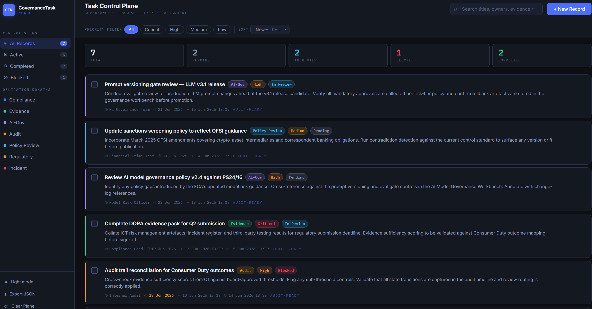

### Dashboard — Light Mode

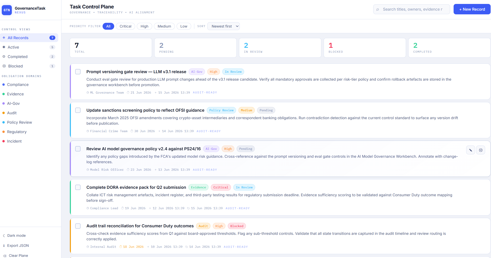

### Add Task Modal

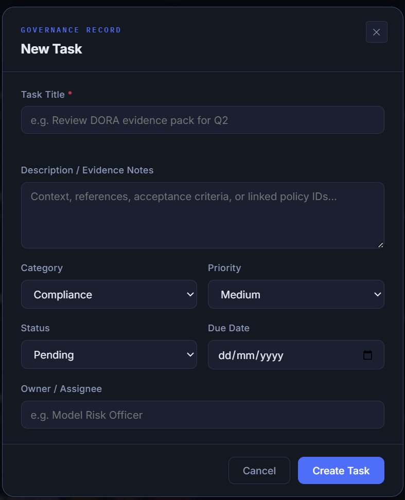

### Edit Task Modal

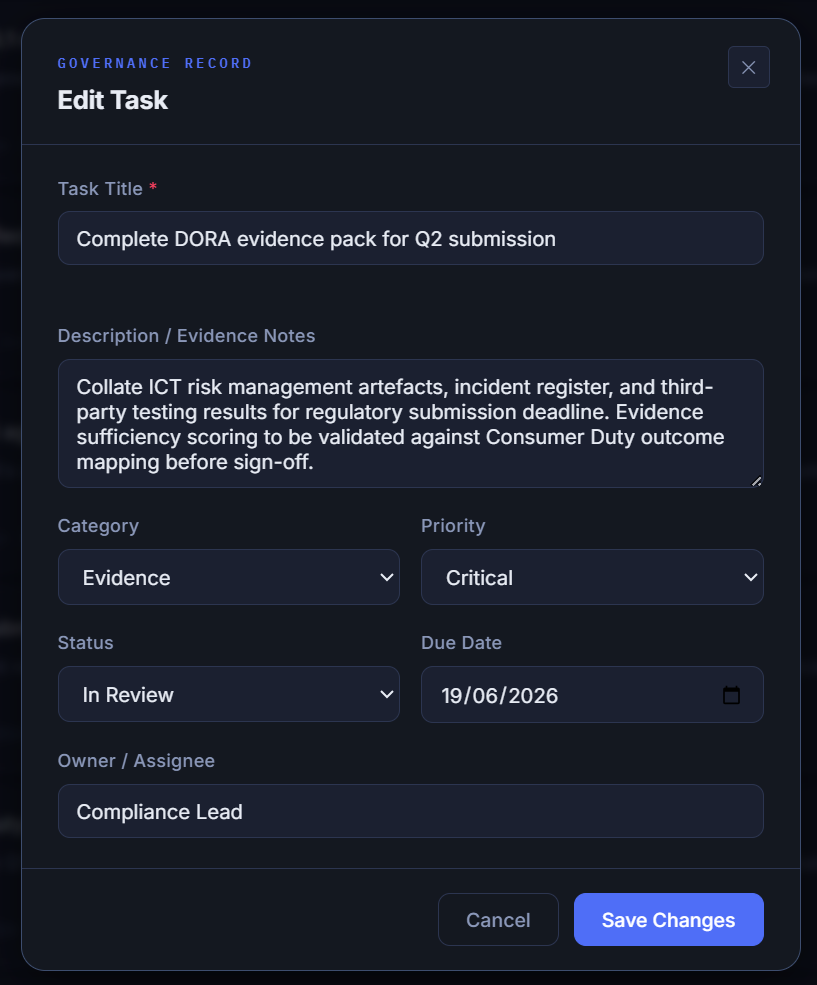

### Search and Filter

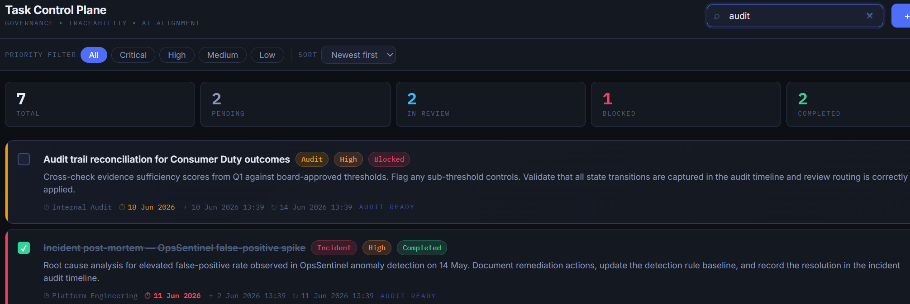

### Category Filter (AI-Gov)

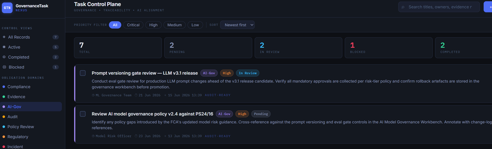

### Priority Chip Filter

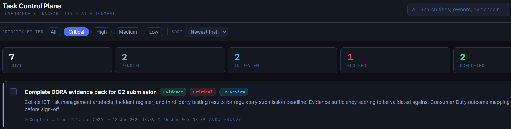

### Delete Confirmation Dialog

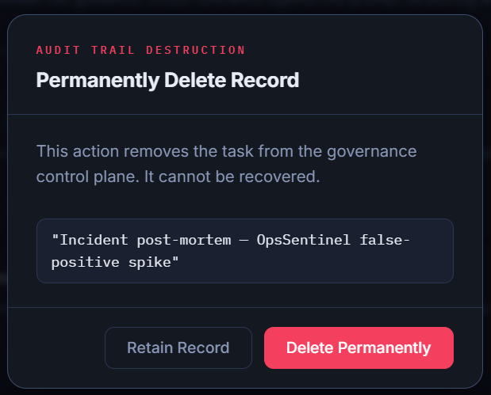

### Toast Notification

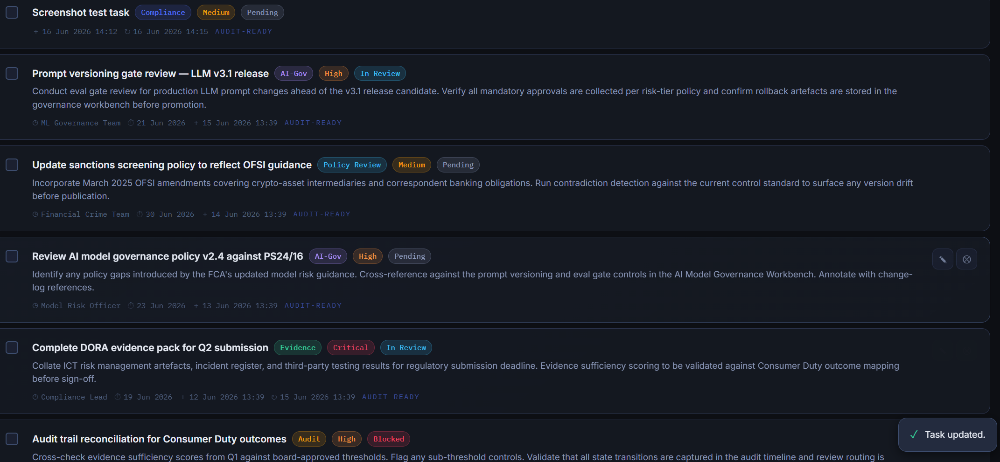

### JSON Export

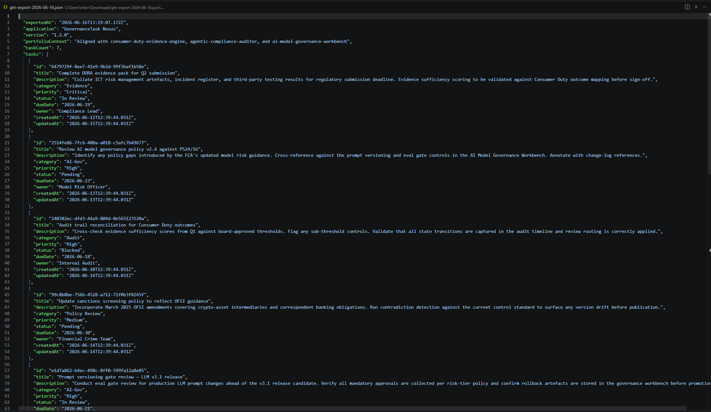

### Empty State

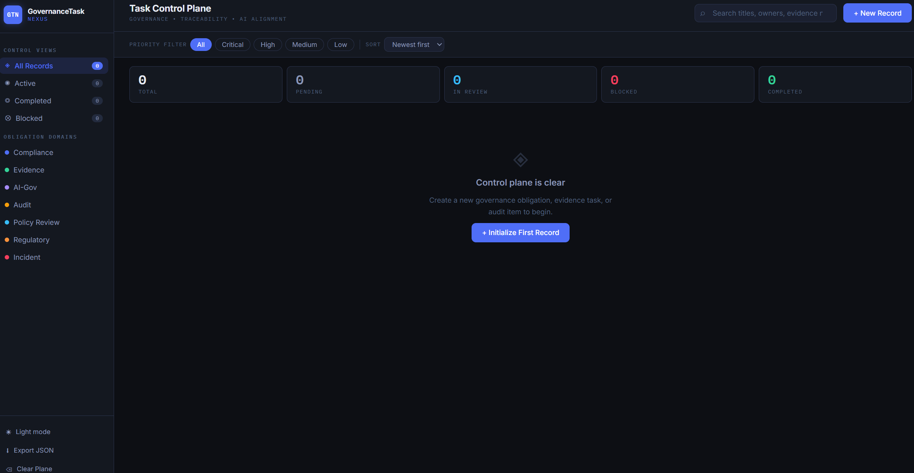

### Mobile Responsive View

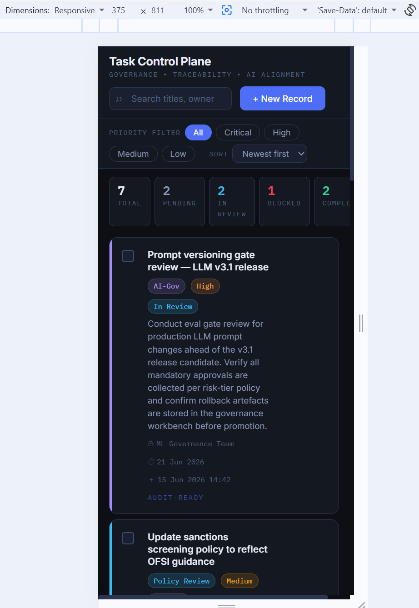

---

## Core Features

- Full CRUD with professional modal add and edit
- 7 governance categories: Compliance, Evidence, AI-Gov, Audit, Policy Review, Regulatory, Incident
- Priority levels: Critical, High, Medium, Low
- Status tracking: Pending, In Review, Blocked, Completed
- Due date highlighting — overdue (red) and near-due (amber)
- Audit-trail timestamps — created and last updated on every record
- Real-time search across titles, owners, descriptions, and notes
- Category, view, and priority filters with animated sidebar badges
- Multi-key sort: newest, oldest, due date, priority, title
- Statistics bar showing live totals by status
- JSON export with portfolio context metadata
- localStorage persistence with realistic seed data on first load
- Dark and light theme toggle with persistence
- Toast notifications for all create, update, delete, and export actions
- Confirm dialog for all destructive operations
- Fully responsive layout for mobile and desktop
- Keyboard accessible throughout with ARIA labels and roles

---

## Tech Stack

| Layer       | Technology                                    |
| ----------- | --------------------------------------------- |
| Markup      | Vanilla HTML5 with semantic elements and ARIA |
| Styles      | CSS3 with Custom Properties (design tokens)   |
| Logic       | ES6+ JavaScript Modules (no bundler needed)   |
| Fonts       | IBM Plex Mono + Inter via Google Fonts        |
| Persistence | Web Storage API (localStorage)                |
| Deployment  | GitHub Pages via GitHub Actions CI/CD         |
| Dev tools   | ESLint + Prettier (zero runtime dependencies) |

---

## Project Structure

```
governance-task-nexus/
├── .github/
│   └── workflows/
│       └── deploy.yml        CI/CD: lint + deploy to GitHub Pages
├── assets/
│   └── screenshots/          Application screenshots for README
├── css/
│   └── styles.css            Design tokens, layout, components
├── js/
│   ├── app.js                Entry point: wiring, filters, sort, export
│   ├── store.js              In-memory store, localStorage, CRUD, seed data
│   ├── render.js             DOM rendering: task cards, stats, badges
│   ├── modal.js              Add/edit modal and confirm delete dialog
│   └── toast.js              Toast notification utility
├── .eslintrc.cjs             ESLint configuration
├── .gitignore                Standard ignores
├── .nvmrc                    Node version pin (20)
├── .prettierrc               Prettier formatting configuration
├── index.html                Single-page application shell
├── package.json              npm scripts and dev dependencies
└── README.md                 This file
```

---
